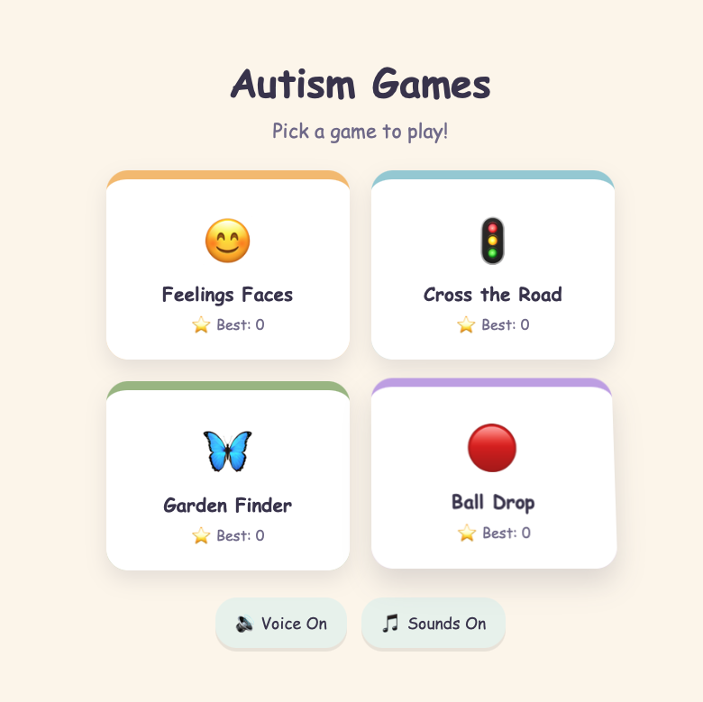
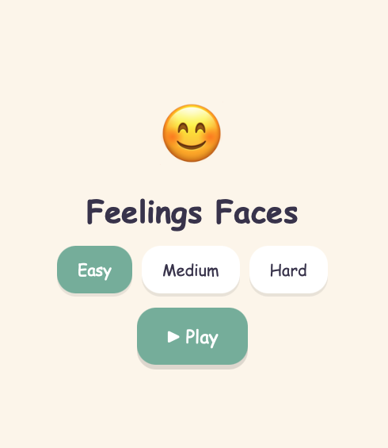
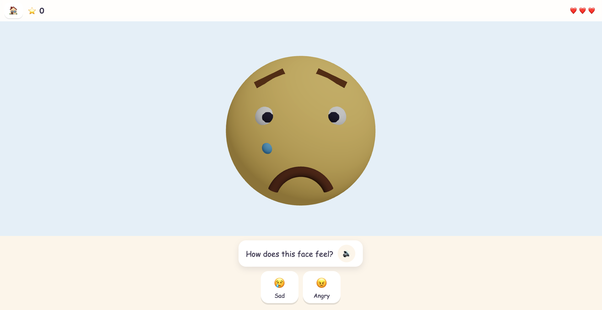
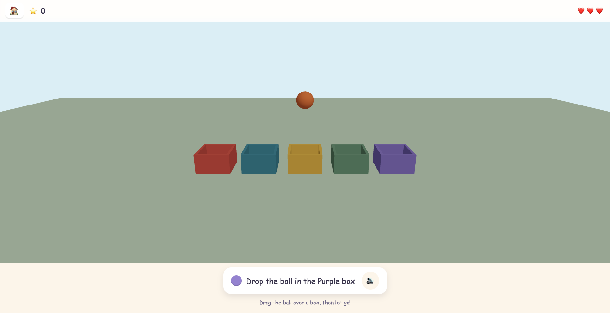

# 🧠 Autism Games

> Interactive, therapeutic games designed to support learning and emotional development for children with autism spectrum disorder.


---

## ✨ Features

🎮 **9 Interactive Games** - Carefully designed therapeutic games for engagement and learning
- **Feelings Faces** - Explore and recognize emotions
- **Cross the Road** - Choose Walk or Wait to cross safely _(timing and decision-making)_
- **Ball Drop** - Physics-based interactive gameplay
- **Emotion Mirror** - Read feelings on an animated 3D face _(emotional recognition)_
- **Block Buddies** - Take turns stacking a tower with a robot _(turn taking)_
- **Museum Look** - Follow a pointing hand to the right exhibit _(joint attention)_
- **Right or Wrong** - Judge whether a social behaviour is fine or needs fixing _(social rules)_
- **Good Choice** - Pick the kind action in a social situation _(social rules)_
- **Slide Queue** - Wait patiently in line for your turn on the slide _(turn taking / patience)_

🔊 **Sound & Voice Support** - Toggle audio and voice guidance on/off
📊 **Score Tracking** - Monitor progress with a built-in scoring system
🎨 **Beautiful UI** - Colorful, engaging interface optimized for all ages
⚡ **Fast & Responsive** - Built with Vite for blazing-fast performance
🎯 **3D Graphics** - Immersive 3D experiences powered by Three.js

---

## 📸 Screenshots

<table>
  <tr>
    <td align="center" width="50%">
      <b>Home Screen</b><br>
      
    </td>
    <td align="center" width="50%">
      <b>Game Selection</b><br>
      
    </td>
  </tr>
  <tr>
    <td align="center" colspan="2">
      <b>Feelings Faces Game</b><br>
      
    </td>
  </tr>
  <tr>
    <td align="center" colspan="2">
      <b>Ball Drop Game</b><br>
      
    </td>
  </tr>
</table>

---

## 🚀 Quick Start

### Prerequisites
- Node.js 18+ 
- npm or yarn

### Installation

```bash
# Clone the repository
git clone https://github.com/subair-zufi/autism-games.git
cd autism-games

# Install dependencies
npm install

# Start development server
npm run dev
```

The application will open at `http://localhost:5173`

---

## 🎮 Games Overview

### 😊 Feelings Faces
Explore and identify different emotions through interactive faces. Perfect for emotional literacy development.

### 🚦 Cross the Road
Navigate safely across the road while avoiding obstacles. Develops timing, decision-making, and risk assessment skills.

### 🔴 Ball Drop
Interactive physics-based game where colored balls drop and react to movement. Encourages hand-eye coordination and spatial awareness.

---

## 🛠️ Available Scripts

```bash
# Development server with hot reload
npm run dev

# Build for production
npm run build

# Preview production build locally
npm run preview

# Run tests
npm run test
```

---

## 📦 Tech Stack

| Technology | Purpose |
|-----------|---------|
| **React 19** | UI framework and component management |
| **TypeScript** | Type-safe development |
| **Three.js** | 3D graphics and rendering |
| **React Three Fiber** | React renderer for Three.js |
| **React Router** | Navigation and routing |
| **Zustand** | State management |
| **Vite** | Build tool and dev server |
| **Vitest** | Unit testing framework |

---

## 🏗️ Project Structure

```
autism-games/
├── src/
│   ├── components/       # Reusable React components
│   ├── games/            # Game implementations
│   │   ├── emotions/     # Feelings Faces game
│   │   └── balldrop/     # Ball Drop game
│   ├── pages/            # Page components
│   ├── state/            # Zustand stores (scores, settings)
│   ├── services/         # Utility services (sounds, etc.)
│   ├── styles/           # Global styles
│   └── App.tsx           # Main app component
├── docs/                 # Documentation and screenshots
├── vite.config.ts        # Vite configuration
└── tsconfig.json         # TypeScript configuration
```

---

## 🎯 Development

### Running Tests
```bash
npm run test
```

### Building for Production
```bash
npm run build
```

This creates an optimized production build in the `dist` folder.

### Environment Setup
- Node version: 18+
- Package manager: npm or yarn

---

## 🤝 Contributing

Contributions are welcome! To contribute:

1. Fork the repository
2. Create a feature branch (`git checkout -b feature/amazing-feature`)
3. Commit your changes (`git commit -m 'Add amazing feature'`)
4. Push to the branch (`git push origin feature/amazing-feature`)
5. Open a Pull Request

---

## 📄 License

This project is licensed under the MIT License - see the LICENSE file for details.

---

## 🙏 Acknowledgments

This project is dedicated to supporting children with autism spectrum disorder through interactive and engaging learning experiences.

---

## 📞 Support & Feedback

Have questions or suggestions? Feel free to:
- Open an issue on GitHub
- Submit feedback through the project repository
- Reach out to the development team

---

<div align="center">
  <strong>Made with ❤️ for autism education and support</strong>
</div>
